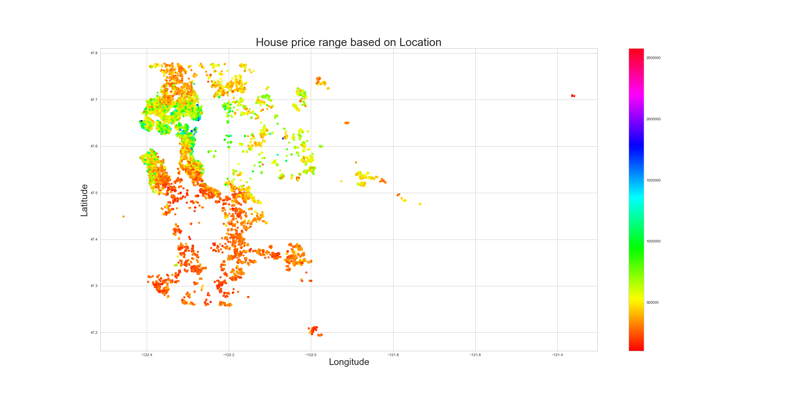

# Housing Price Project

## Business Problem

The king county real estate agency will use this prediction model to give their clients an estimate of the housing price when purchasing or selling houses.  The agency will estimate the price based on certain features like the location of the house, the number of bedrooms, and the size of the house.

### The Data

The king county dataset was provided to me as part of this project by Flatiron School. The dataset consists of 21597 rows, 21 columns with different house features (continuous and categorical). These features will help to understand which factor will affect the selling price. Below is the description of each variable in the data frame:

* **price** -  Price of the house sold, prediction target

* **id** - unique identified for a house
* **date** - the date when the house was sold
* **bedrooms** -  number of bedrooms
* **bathrooms** -  number of bathrooms
* **sqft_living** -  square footage of the house’s interior living space
* **sqft_lots** -  square footage of the land 
* **floors** -  number of floors
* **waterfront** - House which has a view to a waterfront
* **view** - Has been viewed by potential buyers
* **condition** - condition of the house coded from 1 to 5 where 1: Poor- Worn out, and 5:Very Good
* **grade** - index from 1 to 13, where 1–3 falls short of building construction and design, 7 has an average level of construction and design, and 11–13 have a high quality level of construction and design
* **sqft_above** - square footage of house apart from basement
* **sqft_basement** - square footage of the basement
* **yr_built** - the year where the house was built
* **yr_renovated** - Year when house was renovated, and if not 0
* **zipcode** - zip code
* **lat** - Latitude coordinate
* **long** - Longitude coordinate
* **sqft_living15** - The square footage of interior housing living space for the nearest 15 neighbors
* **sqft_lot15** - The square footage of the land lots of the nearest 15 neighbors

## Analysis

The following questions were asked to analyze the data:

1. Is there any relationship between the house’s location and its sale price?

2. What are the top ten zip codes that have the highest selling houses in King County?
3. What are the top ten affordable zip codes in King County?
4. Which features are important to predict the price of the house?

## Conclusion

- 15 features were included in the final model to get the best prediction, The following findings are from the features with the highest coefficients:
- The price of the house is highly affected by its location.
- Houses with larger living space, bigger basement, and more bathrooms have higher predicted price.
- The renovated houses selling price is higher than non-renovated one
- The houses with waterfront have higher selling prices than the ones without one.
- Each increase of the grade will increase the price, with grade 11 in the top

### Limitation:

The size of the dataset,  a lot of features don't have a linear relationship with the target. Maybe a different non-linear model would work better.

### Future work

Use APIs to get King county school district data and link it with the the zip codes.

